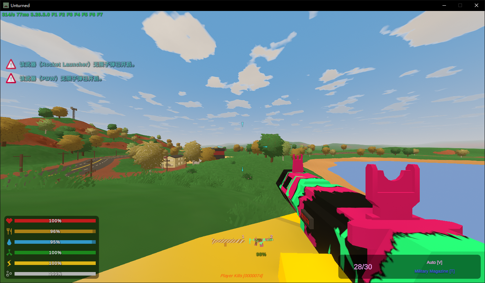
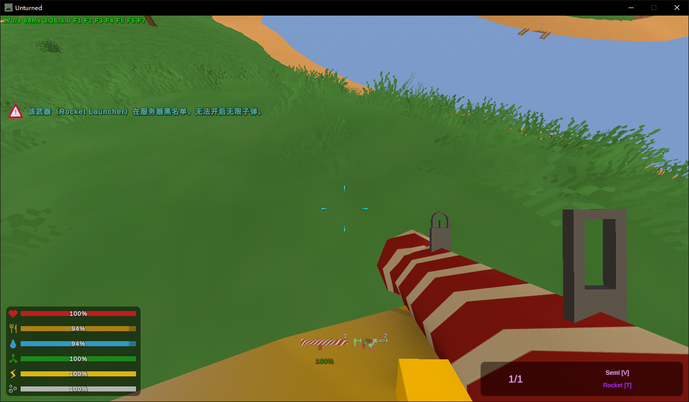
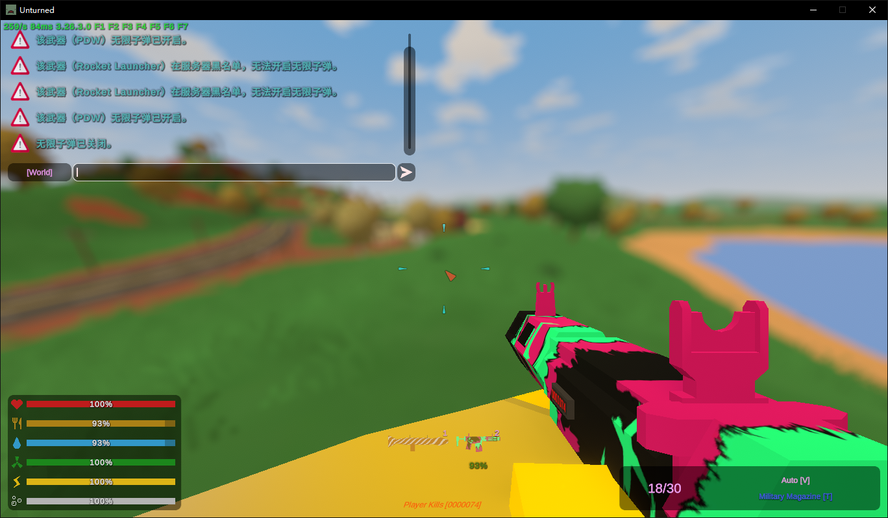
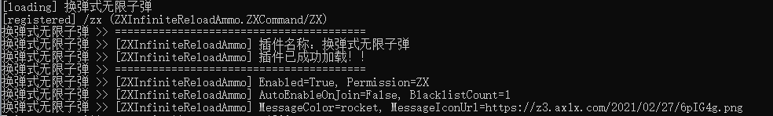

<p align="center">
  
</p>

<h1 align="center">Unturned Infinite Reload Ammo</h1>

<p align="center">
  <strong>换弹式无限子弹插件</strong><br>
  为 Unturned Rocket 服务器提供贴近原版节奏的无限弹匣体验。
</p>

<p align="center">
  
  
  
  
</p>

---

## 项目简介

`Unturned Infinite Reload Ammo` 是一个用于 Unturned Rocket 服务器的换弹式无限子弹插件。

插件不会跳过玩家原本的换弹动作，而是在玩家换弹时自动补满旧弹匣与新弹匣，让无限子弹效果保持自然节奏，适合 PVE、娱乐服、活动服或特殊职业玩法。

## 功能亮点

| 功能 | 说明 |
| --- | --- |
| 玩家自助开关 | 玩家可通过 `/ZX ON` 与 `/ZX OFF` 自行控制功能状态。 |
| 权限控制 | 默认权限节点为 `ZX`，可在配置文件中自定义。 |
| 换弹补满 | 保留原始换弹动作，仅在换弹请求中补满弹匣。 |
| 进服自动开启 | 可配置玩家进入服务器后自动启用无限子弹。 |
| 武器黑名单 | 黑名单内武器不会触发无限子弹效果。 |
| 聊天样式配置 | 支持自定义消息颜色与消息图标。 |
| 自动说明文件 | 插件加载后会生成中文使用说明文件，便于服主查看。 |

## 效果展示

### 游戏内启用



### 黑名单拦截



### 玩家反馈



### 服务器加载



## 运行环境

| 项目 | 要求 |
| --- | --- |
| 游戏服务器 | Unturned Rocket 服务器 |
| 目标框架 | `.NET Framework 4.8` |
| 主要依赖 | `RestoreMonarchy.RocketRedist` |
| 输出文件 | `换弹式无限子弹.dll` |

## 快速开始

### 1. 构建插件

```powershell
dotnet restore
dotnet build "换弹式无限子弹.csproj" -c Release
```

构建成功后，插件文件位于：

```text
bin/Release/net48/换弹式无限子弹.dll
```

### 2. 安装到服务器

1. 将 `换弹式无限子弹.dll` 复制到服务器目录的 `Rocket/Plugins` 文件夹。
2. 启动或重启 Unturned Rocket 服务器。
3. 控制台出现 `ZXInfiniteReloadAmmo` 加载日志后，即表示插件已加载。

首次加载后会生成配置文件：

```text
Rocket/Plugins/换弹式无限子弹/换弹式无限子弹.configuration.xml
```

同时会生成中文说明文件：

```text
Rocket/Plugins/换弹式无限子弹/无限子弹(换弹匣式)插件使用说明.TXT
```

## 玩家命令

玩家需要拥有配置项 `Permission` 中设置的权限节点，默认是 `ZX`。

| 命令 | 效果 |
| --- | --- |
| `/ZX ON` | 开启无限子弹。 |
| `/ZX OFF` | 关闭无限子弹。 |

当玩家未传入参数或参数不正确时，插件会提示：

```text
用法：/ZX <ON|OFF>
```

## 配置说明

默认配置会在插件首次加载时由 Rocket 自动生成。常用配置项如下：

```xml
<Enabled>true</Enabled>
<Permission>ZX</Permission>
<WeaponBlacklist>
  <ushort>58961</ushort>
</WeaponBlacklist>
<Debug>false</Debug>
<AutoEnableOnJoin>false</AutoEnableOnJoin>
<MessageIconUrl>https://z3.ax1x.com/2021/02/27/6pIG4g.png</MessageIconUrl>
<MessageColor>rocket</MessageColor>
```

| 配置项 | 默认值 | 说明 |
| --- | --- | --- |
| `Enabled` | `true` | 是否启用插件整体功能。 |
| `Permission` | `ZX` | 使用插件功能所需的权限节点。 |
| `WeaponBlacklist` | `58961` | 武器黑名单。填入武器 ID 后，该武器不会获得无限子弹效果。 |
| `Debug` | `false` | 是否输出调试日志。 |
| `AutoEnableOnJoin` | `false` | 玩家进入服务器时是否默认开启无限子弹。 |
| `MessageIconUrl` | 内置图片链接 | 聊天消息图标链接，留空则不显示图标。 |
| `MessageColor` | `rocket` | 聊天消息颜色，支持 Rocket 颜色名称或 `#RRGGBB` 格式。 |

## 工作机制

插件通过监听玩家装备武器与换弹请求来处理状态：

1. 玩家拥有权限并执行 `/ZX ON` 后，插件记录该玩家的启用状态。
2. 玩家换弹时，插件检查服务器开关、玩家权限、玩家启用状态与武器黑名单。
3. 条件通过后，插件补满旧弹匣与新弹匣的 `amount`，实现换弹式无限子弹。
4. 玩家离线时，插件会清理该玩家的启用状态与事件挂钩。

## 开发信息

| 模块 | 说明 |
| --- | --- |
| `ZXInfiniteReloadAmmoPlugin` | 插件入口、事件注册、换弹逻辑与消息发送。 |
| `ZXCommand` | `/ZX ON` 与 `/ZX OFF` 命令处理。 |
| `ZXIRAConfiguration` | Rocket 插件配置项与默认值。 |
| `ZXUsageDocumentWriter` | 插件加载时生成中文使用说明文件。 |

## 许可证

本项目基于 [MIT License](LICENSE) 开源。
